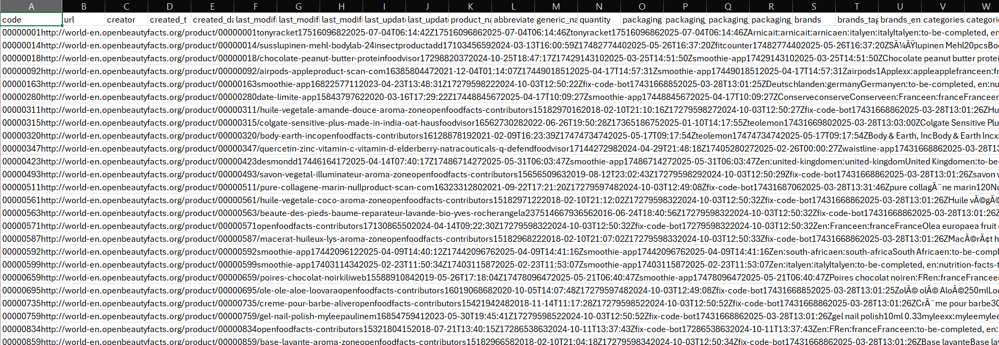
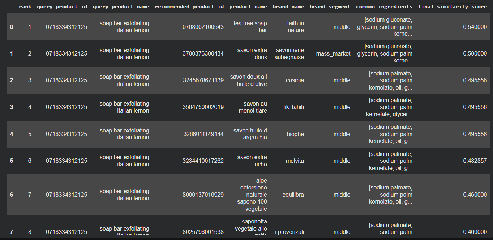
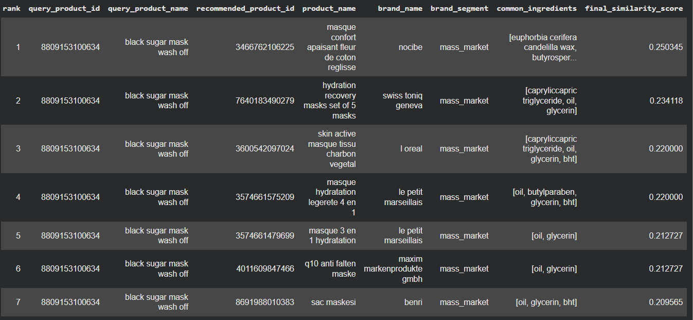

<h1 align="center">Sistema di raccomandazione a livello di similarità del prodotto</h1>

<b>Un approccio multi-dimensionale per il ranking di prodotti cosmetici basato su ingredienti e brand.</b> 

<h2>📖 Panoramica</h2>
La presente repository contiene dei notebook Jupyter che implementano una <b>pipeline di similarità e raccomandazione</b> finalizzata all’identificazione dei prodotti più simili a un prodotto query. 
Il sistema combina più dimensioni di similarità in uno <b>score composito</b>, garantendo un allineamento semantico e strutturale degli spazi di similarità prima dell'aggregazione. 

<h2>📊 Dataset e Analisi Preliminare</h2>
Il progetto utilizza dati estratti da <b>OpenFoodFacts</b>, focalizzandosi esclusivamente sui prodotti di <b>cosmetica</b>.

<ul>
  <li><b>Dimensione originale:</b> Circa 60.000 righe.</li>
  <li><b>Dataset Raw:</b> Il dataset di partenza conteneva informazioni grezze che sono state successivamente filtrate.</li>
</ul>

  
   <i>Visualizzazione del dataset grezzo prima delle fasi di pulizia.</i>

Dal dataset originale sono stati ricavati due subset distinti:
1. <b>Dataset Brand:</b> Contenente le informazioni sulla marca.
2. <b>Dataset Ingredienti:</b> Contenente la composizione chimica del prodotto.

<h2>👥 Divisione del Lavoro</h2>
Il lavoro è stato suddiviso tra tre membri del team con i seguenti compiti:

<table align="center">
  <tr>
    <th>Membro</th>
    <th>Task</th>
  </tr>
  <tr>
    <td><b>Elisa</b></td>
    <td>Pulizia e normalizzazione dataset Brand, calcolo similarità brand e scrittura del codice per la similarità finale.</td>
  </tr>
  <tr>
    <td><b>Giulia G.</b></td>
    <td>Pulizia e normalizzazione dataset Ingredienti e calcolo della relativa similarità.</td>
  </tr>
  <tr>
    <td><b>Giulia F.</b></td>
    <td>Assegnazione delle categorie ai prodotti, partecipazione alla sezione ingredienti e assemblaggio dei codici (merge).</td>
  </tr>
</table>

<h2>🛠️ Struttura della Repository e Script</h2>
Gli script devono essere consultati nel seguente ordine cronologico:

<ol>
  <li><b><code>pulizia_brand.ipynb</code></b>: Pulizia e normalizzazione del dataset brand. Produce il file <code>df_brand.csv</code>.</li>
  <li><b><code>script_ingredienti_pulizia</code></b>: Script parallelo per la pulizia e normalizzazione degli ingredienti.</li>
  <li><b><code>categoria&brand&ingr.ipynb</code></b>: Assegnazione delle categorie ai dataset. Produce il file <code>brand_categoria.csv</code>.</li>
  <li><b><code>matrice_one_time</code></b>: Implementazione dell'algoritmo per la creazione della matrice 1xK.</li>
  <li><b><code>algoritmo_finale.ipynb</code></b>: Codice definitivo che include la matrice ingredienti e calcola la <b>similarità finale</b>.</li>
</ol>

<h2>🔬 Impianto Metodologico</h2>
L'obiettivo è generare una lista ordinata di prodotti coerenti per composizione e brand. Lo score finale è una combinazione lineare pesata.

 

<ul>
 <li><b>Similarità Ingredienti (Peso 0.8):</b> Valuta la composizione chimica. </li>
  <li><b>Similarità Brand (Peso 0.2):</b> Valuta la coerenza di marca. </li>
  <li><b>Allineamento:</b> Gli score vengono aggregati solo dopo un'operazione di merge basata su un identificatore univoco (code). </li>
</ul>

<h2>📋 Output del Sistema</h2>
L'output finale è una tabella <b>product-centric</b> dove ogni riga rappresenta un prodotto reale nel catalogo.

<b>Campi inclusi:</b> 
<ul>
  <li><code>query_product_id</code>: codice prodotto di partenza</li> <li><code>recommended_product_id</code>: codice prodotto raccomandato</li> <li> <code>product_name</code>: nome prodotto </li> 
 <li><code>brand_name</code>: nome del marchio </li> <li><code>market_segment</code>: segmento di mercato relativo al marchio</li> 
  <li><code>final_similarity_score</code> : punteggio di similarità tra il prodotto di partenza e il prodotto suggerito</li>
  <li><code>rank</code>: posizione ranking</li>
</ul>

<h3 align="center">Esempi di Raccomandazione</h3>

  
  

<h2>🚀 Possibili Estensioni</h2>
<ul>
<li>Normalizzazione e calibrazione degli score.</li>
<li>Ottimizzazione dei pesi e analisi di sensibilità. </li>
<li>Raccomandazioni vincolate per brand o segmento di mercato. </li>
</ul>
